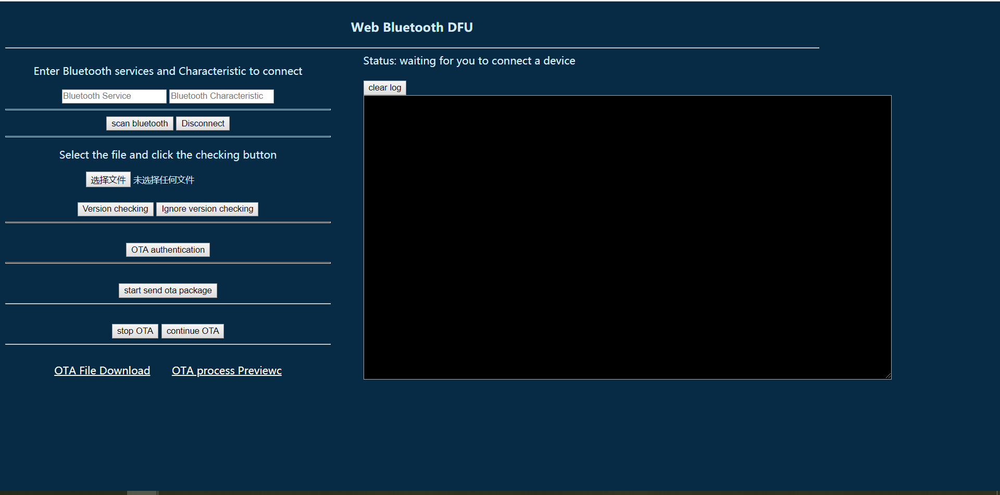
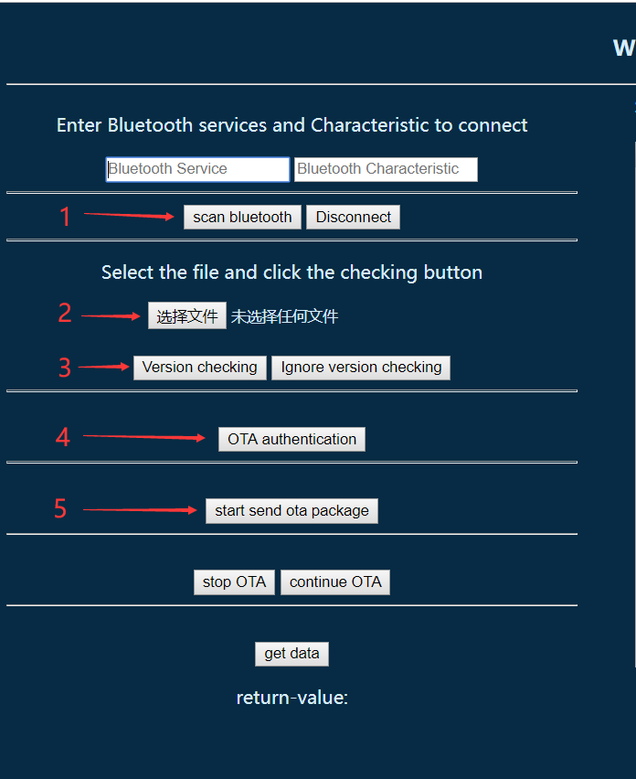
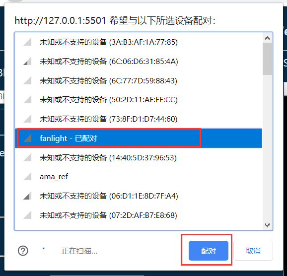
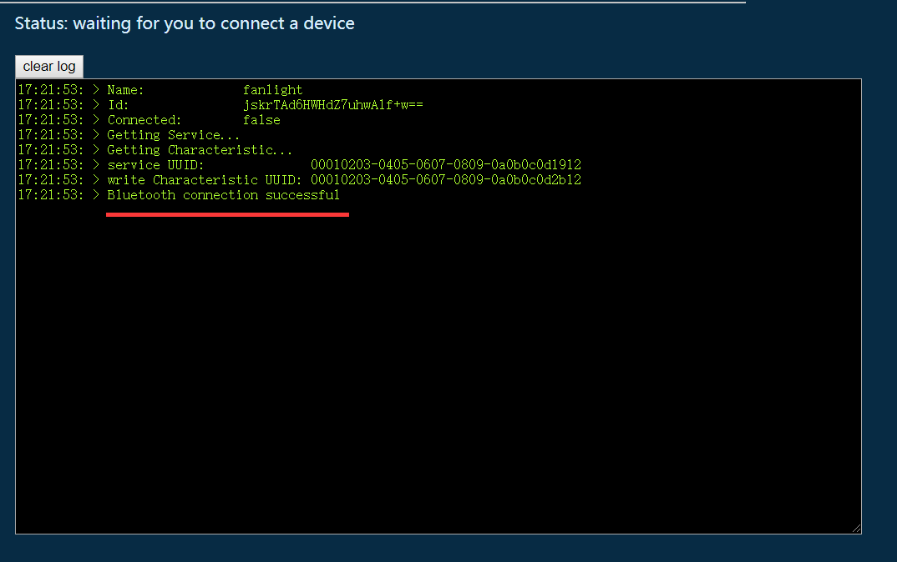
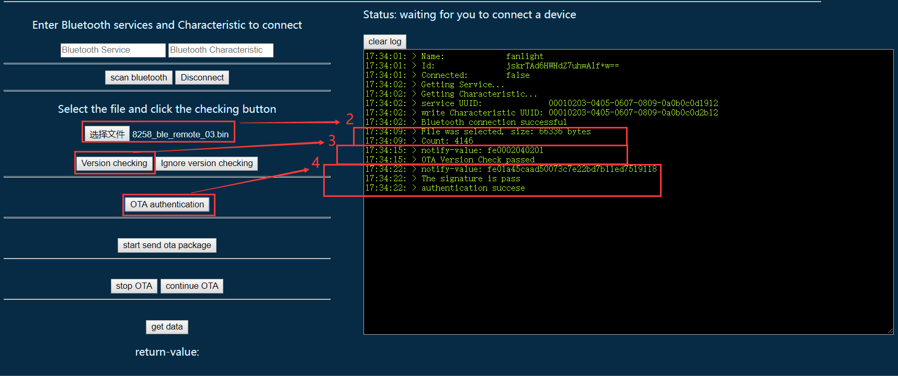
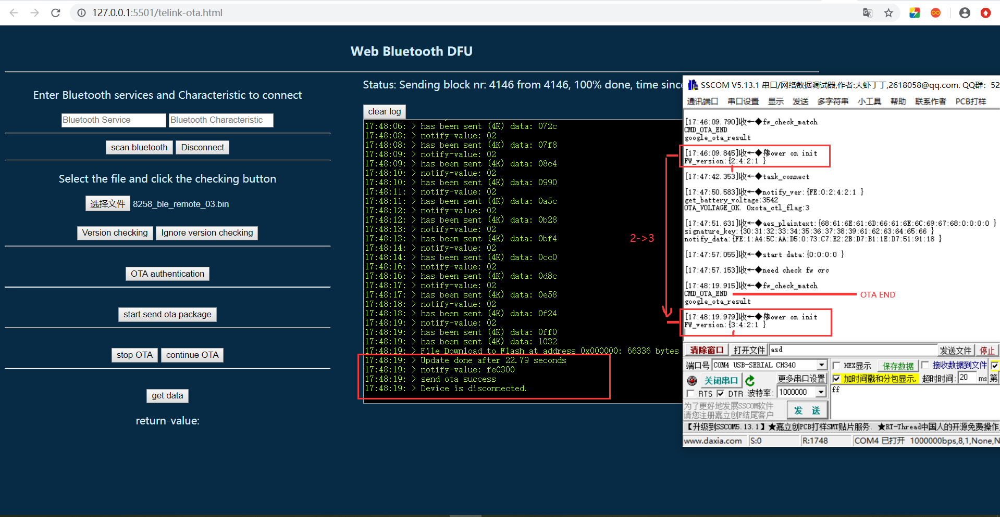
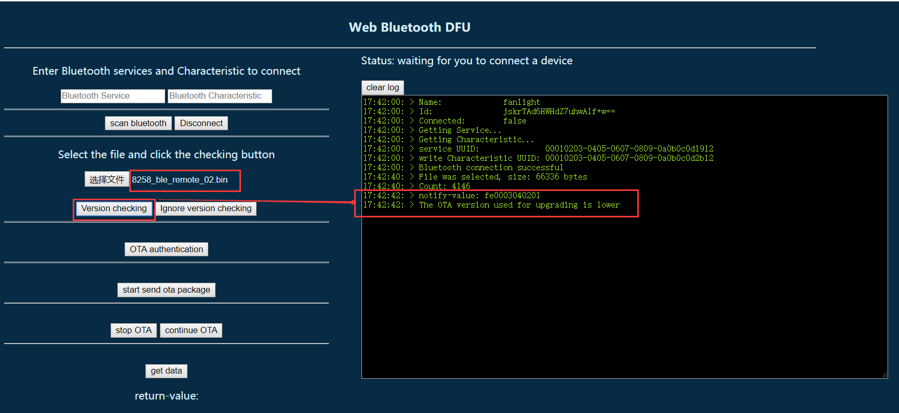
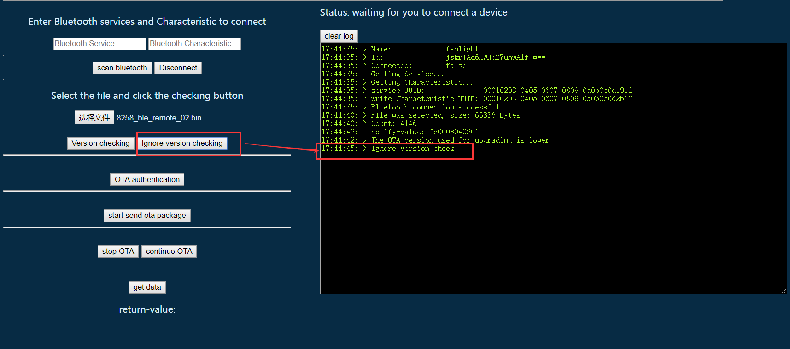

# web bluetooth DFU

- [web bluetooth](https://webbluetoothcg.github.io/web-bluetooth/)
- [web bluetooth samples](https://googlechrome.github.io/samples/web-bluetooth/index.html)
- [web bluetooth github](https://github.com/WebBluetoothCG/web-bluetooth)
- [web bluetooth API](https://developer.mozilla.org/en-US/docs/Web/API/Web_Bluetooth_API)
- [Interact with Bluetooth devices on the Web](https://developers.google.com/web/updates/2015/07/interact-with-ble-devices-on-the-web)

## 介绍

通过浏览器访问连接地址打开网页，使用web Bluetooth连接到telink开发板蓝牙，实现任何地点，电脑或手机设备对其发送ota包，从而对其进行无线升级。

1. 有浏览器，可上网的电脑或手机。
2. 有ota的bin文件
3. 通电启动的telink开发板

### 使用

[https://zhanenkui.github.io/telink_DFU.github.io/](https://zhanenkui.github.io/telink_DFU.github.io/)

**访问以上连接，进入web blutooth DFU界面：**

#### 1.开启自身设备蓝牙,点击标记`1`处的`scan bluetooth`按钮

**点击`scan bluetooth`按钮，会弹出附近蓝牙设备列表，点击你需要连接的蓝牙设备，然后点击配对。**

**右侧`log-info`中显示`bluetooth connetion successful`则成功连接上了蓝牙设备。**

#### 2.点击选择文件按钮，选择相应`bin`文件，点击`version checking`版本效验，然后点击`OTA authentication`签名认证

#### 3.以上效验都通过之后点击`start send ota package`开始发送ota包(右侧会有发送的状态以及数据信息)

在log中出现`send ota success`并且设备断开连接了，而右侧白色框(串口工具)界面中显示CMD-OTA-END,并且重新上电，显示新版本信息`FW_version:{3:4:2:1 }`则表示升级成功了。

**注意：**
如果选择升级的ota包版本低于固件版本，则做版本效验会失败

**你可以选择点击`Ignore version checking`按钮来忽略版本检测：**

### 固件环境介绍

因为初期还有很多问题需要不断改进，并不能做到对所有固件都正常使用，后续还会不断更新改进。  
**固件环境需求：**  

1. 必须要是BLE设备
2. SMP加密
